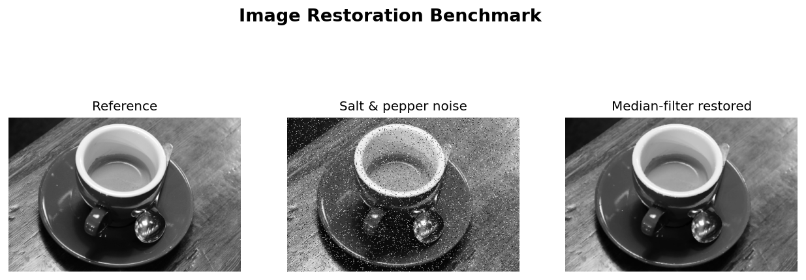
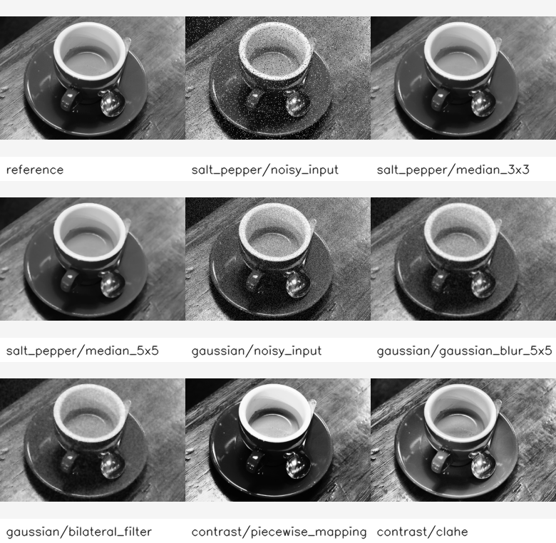

# Image Restoration Benchmark


A compact computer-vision toolkit for **controlled image degradation, restoration, contrast enhancement, and quality evaluation**. It consolidates earlier image-processing notebooks into a reusable benchmark pipeline with package code, CLI tools, docs, sample assets, and tests. The original notebooks are preserved under `legacy/`.



## Features

- Generate Gaussian noise and salt-and-pepper impulse noise.
- Restore degraded images with median, Gaussian, and bilateral filters.
- Enhance contrast with piecewise intensity mapping and CLAHE.
- Evaluate outputs with MAE, MSE, PSNR, and a lightweight global SSIM.
- Export metric tables (CSV/JSON), individual output images, and a montage.
- Ship an open-source natural sample image so the repo runs without private data.

## Results

Benchmark on the bundled open-source sample (`assets/samples/coffee.png`, from scikit-image):

| Case | Method | PSNR | SSIM |
| --- | --- | ---: | ---: |
| salt_pepper | noisy_input | 16.24 | 0.800 |
| salt_pepper | median_3x3 | 31.06 | 0.992 |
| gaussian | noisy_input | 20.54 | 0.919 |
| gaussian | bilateral_filter | 27.93 | 0.984 |
| contrast | clahe | 20.13 | 0.915 |



## Project Structure

```text
image-restoration-benchmark/
├── app/                          # CLI entry point
├── image_restoration_benchmark/  # core: noise, filters, contrast, metrics, pipeline
├── scripts/                      # reproducible commands (run_benchmark.py)
├── assets/
│   ├── samples/                  # open-source input image (+ SOURCES.md)
│   └── example_outputs/          # metrics, montage, and README preview
├── docs/                         # method notes
├── tests/                        # pytest unit tests
└── legacy/                       # original notebooks, executed and kept for traceability
```

## Installation

```powershell
python -m venv .venv
.\.venv\Scripts\activate
python -m pip install -U pip
python -m pip install -e .[dev]
```

## Usage

```powershell
# Regenerate the example outputs shown above
python scripts/run_benchmark.py --input assets\samples\coffee.png --output-dir assets\example_outputs

# Tune the experiment
python scripts/run_benchmark.py --input path\to\image.png --output-dir experiments\custom --seed 42 --salt-pepper-amount 0.08 --gaussian-sigma 25
```

Run the tests:

```powershell
python -m pytest -q
```

## Method Overview

```text
reference image
  -> controlled degradation (Gaussian noise, salt-and-pepper noise)
  -> restoration candidates (median filters, Gaussian blur, bilateral filter)
  -> contrast enhancement (piecewise mapping, CLAHE)
  -> metric evaluation (MAE, MSE, PSNR, SSIM)
  -> CSV, JSON, images, montage
```

## Notes & Limitations

- The demo uses a single open-source natural image; results illustrate the pipeline rather than dataset-wide performance.
- Global SSIM is a lightweight, dependency-free approximation of windowed SSIM.
- PSNR/SSIM do not always match human visual preference, especially after contrast enhancement.

## Roadmap

- Batch mode for folders of images.
- More restoration methods (non-local means, unsharp masking).
- HTML/Markdown report generation.
- Metric plots across multiple noise levels.

## License

Released under the [MIT License](LICENSE). Sample images keep their own licenses — see
[`assets/samples/SOURCES.md`](assets/samples/SOURCES.md) and the `SOURCES.md` files under `legacy/*/sample/`.
